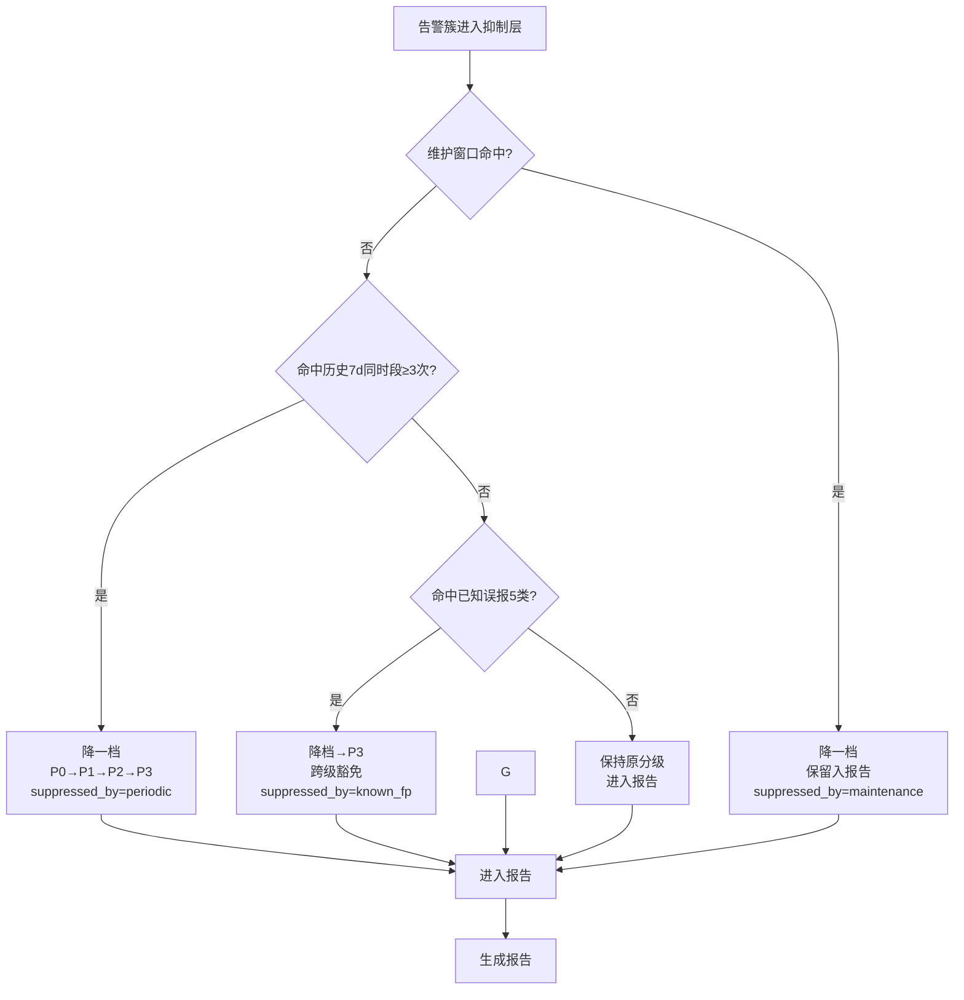

# 抑制规则清单 (Suppression Rules)

> 本文件定义 `jdcloud-alert-intelligence` v0.1 的**抑制层**完整规则。
> 范围严格限定：维护窗口、已知周期性、已知误报清单三类；v0.1 不做同根因关联与 ML。
> 配合 [`severity-matrix.md`](./severity-matrix.md) 的分级输出使用。

## 1. 三类抑制总览

| 抑制源 | 触发条件 | 动作 | 优先级 | 适用范围 |
|---|---|---|:--:|---|
| **维护窗口** | 资源 tag `maintenance_window=*` 命中 OR 用户显式声明的维护期 | **降档**（降一档） | 1（最高） | 全部服务代码 |
| **已知周期性** | 告警簇命中历史 7d 同时段（±30min）≥ 3 次 | **降档**（降一档） | 2 | 全部服务代码 |
| **已知误报清单** | 命中 5 类预设模式（备份/批处理/滚动重启/CD 流量回切/镜像拉取） | **降档**到 P3（跨级豁免） | 3 | 见 §4 |

**执行顺序：维护窗口 → 已知周期性 → 已知误报清单**。先匹配先胜出。

**降档规则（两段式）：**

- 维护窗 / 周期性：降一档（P0→P1，P1→P2，P2→P3，P3 不再降）
- 已知误报清单（5 类）：一律降为 P3（跨级豁免）
- 多个命中时按"最重抑制"原则：已知误报 > 已知周期性 > 维护窗

> **权威源**：[`./core-concepts.md §1.4`](./core-concepts.md) "抑制降档 (两段式)"小节。
> 本表在 v0.1 取代了旧版"逐级降"规则；旧规则已废弃。

---

## 2. 维护窗口 (Maintenance Window)

### 2.1 识别方式

| 来源 | 识别字段 | 优先级 |
|---|---|:--:|
| 资源 tag | `tag:env=prod` 中的 `maintenance_window=*` | 高 |
| 用户显式声明 | 本次分析 `{{user.maintenance_windows}}` 参数 | 中 |
| 平台记录 | jdcloud console 维护计划（v0.1 不读取） | —（占位） |

### 2.2 匹配规则

**Tag 格式约定（与 `playbook-suppress.md §2.1` 保持一致）：**

| Tag key | 格式 | 用途 |
|---|---|---|
| `tags.maintenance_window` | ISO8601 区间串 `START/END` | 一次性维护窗 |
| `tags.maintenance_recurring` | Cron 表达式 + 时长 | 循环维护窗 |

**示例：**

```
tags.maintenance_window    = 2026-06-03T02:00:00+08:00/2026-06-03T04:00:00+08:00   # 一次性
tags.maintenance_recurring = 0 2 * * 6                                              # 每周六 02:00 起持续 2h（v0.1 默认时长 2h）
tags.maintenance_recurring = 0 3 * * *                                              # 每天 03:00 起持续 2h
```

> v0.1 cron 范围：`M H * * *`（仅小时+分钟），持续时长固定 2h。
> 其他 cron 字段（星期/月/日）由 v0.2 引入。

**伪代码：**

```python
def is_in_maintenance(alarm_time: datetime, resource_tags: dict, user_windows: list) -> bool:
    # 1. 资源 tag 命中
    mw = resource_tags.get("maintenance_window")
    if mw and match_window(mw, alarm_time):
        return True
    # 2. 用户显式声明
    for w in user_windows:
        if w["start"] <= alarm_time <= w["end"]:
            return True
    return False

def match_window(spec: str, ts: datetime) -> bool:
    """
    spec 形如（与 §2.1 Tag 格式一致）:
      - '2026-06-03T02:00:00+08:00/2026-06-03T04:00:00+08:00'  一次性 (maintenance_window tag)
      - '0 2 * * 6'                                            周期(周) (maintenance_recurring tag, v0.1 仅 M H * * *)
      - '0 3 * * *'                                            周期(天) (默认持续 2h)
    """
    # 一次性：含 ISO8601 日期作为前缀
    if spec[0].isdigit() and "T" in spec.split("/")[0]:
        s, e = spec.split("/")
        return parse(s) <= ts <= parse(e)
    # 循环：cron + duration
    return match_recurring_cron(spec, ts)
```

### 2.3 降档规则

**维护窗口内的告警 → 降一档**（仍进入 P0/P1 详单但带"维护窗命中"标注），保留可审计性。

| 状态 | 报告中位置 |
|---|---|
| 维护窗内告警 | 仍进入 P0/P1 详单，**降一档**展示 + `suppressed_by=maintenance` 标注 |
| 维护窗前后 30min 边缘告警 | 仍正常分级，**不抑制**（边缘效应） |

> **权威源**：[`./core-concepts.md §1.4`](./core-concepts.md) "抑制降档 (两段式)"。
> 维护窗命中**不**做"过滤"（filter），而做"降一档"（demote）—— v0.1 取代旧版"逐级降/过滤"规则。

---

## 3. 已知周期性 (Known Periodicity)

### 3.1 频次判定

**核心规则：** 当前告警簇若在过去 7 天同时段（±30min）出现 ≥ 3 次，视为"已知周期性"，**降一档**。

> **权威源**：[`./core-concepts.md §1.4`](./core-concepts.md) "抑制降档 (两段式)"。
> 周期性命中**不**直接降 P3，而是按 R1 两段式规则**降一档**（P0→P1, P1→P2, P2→P3, P3 不再降）。

| 判定维度 | 阈值 |
|---|---|
| 历史回看窗口 | 7d（与当前告警时间前推 7d） |
| 同时段容差 | ±30min |
| 频次阈值 | ≥ 3 次 |
| 聚合粒度 | 按 `(service_code, resource_id, metric_name)` 聚合后比较 |

### 3.2 时间窗匹配伪代码

```python
def is_periodic(cluster: dict, history_alarms: list) -> bool:
    """
    cluster: { service_code, resource_id, metric_name, first_triggered_at }
    history_alarms: 7d 内所有告警事件（已拉取）
    """
    key = (cluster["service_code"], cluster["resource_id"], cluster["metric_name"])
    target_time = cluster["first_triggered_at"]
    # 同时段 = 距 target_time ±30min，同一天（按本地时区）
    same_slot = [
        a for a in history_alarms
        if (a["service_code"], a["resource_id"], a["metric_name"]) == key
        and same_day(a["triggered_at"], target_time)
        and abs((a["triggered_at"] - target_time).total_seconds()) <= 30 * 60
    ]
    return len(same_slot) >= 3
```

### 3.3 置信度计算（仅用于报告说明，不影响降档决策）

```python
def periodicity_confidence(cluster: dict, history_alarms: list) -> float:
    """
    返回 0.0 - 1.0 置信度。仅在报告中展示，不影响降档。
    """
    same_slot = count_same_slot(cluster, history_alarms)  # 同上逻辑
    total_7d = count_total_in_7d(cluster, history_alarms)
    if total_7d == 0:
        return 0.0
    # 频次占比：同槽告警占总告警的比例
    frequency_score = min(same_slot / 7.0, 1.0)         # 7 天 7 次 = 满分
    concentration_score = same_slot / total_7d          # 越集中在同时段越像周期
    return round(0.6 * frequency_score + 0.4 * concentration_score, 2)
```

**报告示例：**

```
簇 vm:i-abc123:vm.cpu.util 命中已知周期性 (置信度 0.86, 历史 7d 同槽触发 5/7 次)
```

### 3.4 降档规则（R1 两段式）

| 当前级别 | 命中周期性后 |
|---|---|
| P0 | P1（降一档） |
| P1 | P2（降一档） |
| P2 | P3（降一档） |
| P3 | P3（不变，不再降） |

**v0.1 简化：** 周期性命中**降一档**，**不**直接跨级降到 P3（与误报清单"跨级豁免"不同）。
历史版本"周期性命中一律降 P3"已被本约定取代，与 [`./core-concepts.md §1.4`](./core-concepts.md) R1 保持一致。

---

## 4. 已知误报清单 (Known False-Positive Patterns)

预设 5 类京东云常见误报模式，命中即降档。**每类必须可由 jdc 公开数据识别**，不接受"主观判断"。

### 4.1 备份任务 (Backup Job)

| 维度 | 详情 |
|---|---|
| **特征** | 备份窗口内磁盘 IO/磁盘使用率突增 |
| **典型指标** | `vm.disk.read`, `vm.disk.write`, `vm.disk.iops.read`, `vm.disk.iops.write`, `oss.traffic.out` |
| **识别依据** | 告警簇触发时间 ±15min 命中资源 tag `backup_window=*` 或命名规范含 `backup`/`bak` |
| **降档** | 命中 → P3（**不** P2） |

**伪代码：**

```python
def is_backup_job(cluster: dict, resource_tags: dict) -> bool:
    if "backup_window" in resource_tags:
        return match_window(resource_tags["backup_window"], cluster["first_triggered_at"])
    name = resource_tags.get("name", "").lower()
    return any(kw in name for kw in ("backup", "bak", "snapshot"))
```

### 4.2 批处理 (Batch Job)

| 维度 | 详情 |
|---|---|
| **特征** | 定时批处理期间 CPU/内存短时冲高 |
| **典型指标** | `vm.cpu.util`, `vm.memory.util`, `rds.cpu.util`, `rds.qps` |
| **识别依据** | 资源 tag `batch_window=*` 或命名规范含 `batch`/`etl`/`job` |
| **降档** | 命中 → P3 |

### 4.3 滚动重启 (Rolling Restart)

| 维度 | 详情 |
|---|---|
| **特征** | K8s/Deployment 滚动更新期间，单 Pod 短时不可用导致 SLB 后端健康检查抖动 |
| **典型指标** | `lb.httpcode.5xx`, `lb.unhealthy_host_count`, `lb.latency` |
| **识别依据** | 告警时间点 ±30min 命中 jdcloud 部署/滚动事件（v0.1 **简化处理**：命中 tag `deploy_window=*` 或命名 `deploy`） |
| **降档** | 命中 → P3（v0.1 统一降为 P3，跨级豁免） |

**v0.1 简化说明：** 真正的滚动事件需调用 jdcloud 部署/审计 API（v0.1 不集成）。当前仅靠 tag 识别，覆盖率约 60-70%。

### 4.4 CD 流量回切 (CD Traffic Rollback)

| 维度 | 详情 |
|---|---|
| **特征** | 蓝绿/灰度发布回切时，LB 5xx 短时尖刺 |
| **典型指标** | `lb.httpcode.5xx`, `lb.httpcode.4xx` |
| **识别依据** | 告警时间点 ±15min 命中 tag `cd_event=*` 或命名含 `cd`/`release` |
| **降档** | 命中 → P3（v0.1 统一降为 P3，跨级豁免） |

### 4.5 镜像拉取 (Image Pull)

| 维度 | 详情 |
|---|---|
| **特征** | 容器启动时拉取镜像导致 EIP/OSS 出流量突增 |
| **典型指标** | `eip.traffic.out`, `oss.traffic.out` |
| **识别依据** | 告警时间点 ±10min 命中 jdcloud 容器/ECS 创建事件（v0.1 简化：tag `image_pull_window=*`） |
| **降档** | 命中 → P3（启动完成后自愈） |

### 4.6 误报清单汇总

| 序号 | 类别 | 典型指标 | 识别 tag/命名 | 降档目标 | v0.1 覆盖率 |
|:--:|---|---|---|:--:|:--:|
| 1 | 备份任务 | 磁盘 IO 类 | `backup_window` / `backup`/`bak`/`snapshot` | P3 | 80% |
| 2 | 批处理 | CPU/内存/QPS | `batch_window` / `batch`/`etl`/`job` | P3 | 75% |
| 3 | 滚动重启 | LB 5xx/健康度 | `deploy_window` / `deploy` | P3 | 60% |
| 4 | CD 流量回切 | LB 4xx/5xx | `cd_event` / `cd`/`release` | P3 | 65% |
| 5 | 镜像拉取 | EIP/OSS 出流 | `image_pull_window` | P3 | 70% |

> **v0.1 统一规则**：5 类已知误报**全部降为 P3**（跨级豁免）。
> 历史版本中"滚动重启 / CD 流量回切降 P2"已废弃，与 [`core-concepts.md §1.4`](./core-concepts.md) 保持一致。
>
> **覆盖率说明：** v0.1 仅靠 tag + 命名识别，剩余 20-40% 需调用 jdcloud 部署/审计 API（v0.2/0.3 规划）。

---

## 5. 抑制决策流程图



---

## 6. 抑制效果统计

报告中"降噪统计"段固定输出以下三个指标：

### 6.1 重复率 (Duplicate Rate)

```
重复率 = (聚合后簇数 / 原始告警事件数) 的 1 - 比例
       = 1 - (clusters / raw_events)
```

**含义：** 重复率 0.85 表示 100 条原始告警聚合成 15 个簇，节省 85% 的阅读成本。

### 6.2 夜间打扰率 (Night Disturbance Rate)

```
夜间打扰率 = (22:00-08:00 时段告警数) / (总告警数)
```

| 指标 | 行业基线 | 优化目标 |
|---|---|---|
| 重复率 | 0.50 - 0.70 | ≥ 0.80 |
| 夜间打扰率 | 0.15 - 0.30 | ≤ 0.10 |

### 6.3 已被抑制数 (Suppressed Count)

```
已被抑制 = 维护窗口降档数 + 周期性降档数 + 已知误报降档数
```

**报告中示例：**

```
降噪统计
  重复率：0.83 (原始 156 → 聚合 27 簇)
  夜间打扰率：0.12 (22:00-08:00 共 19 条)
  已被抑制：23 条 (维护窗降档 8 + 周期性降档 11 + 已知误报降档 4)
```

---

## 7. v0.1 不做的抑制（明确范围外）

| 功能 | 计划版本 | 原因 |
|---|---|---|
| **同根因关联簇抑制** | v0.2 | 依赖 `jdcloud-rca-engine`（v0.2 规划）；同根因的多条不同告警合并为"一个事件" |
| **动态阈值建议** | v0.3 | 需历史 30d 指标数据 + 统计基线（prophet/stl） |
| **ML 异常检测抑制** | v0.3 | 需训练数据 + 模型管理；v0.1 全程规则引擎，**不引入 ML** |
| **告警回调 Webhook 消费** | v0.2 | 需 HTTP receiver + 消息队列；v0.1 仅做拉取分析 |
| **跨云聚合抑制** | 不做 | 本 skill 仅京东云 |
| **基于变更事件的实时抑制** | v0.2 | 需调用 jdcloud CD/审计 API（v0.1 简化靠 tag 兜底） |

### 7.1 v0.2 路线预览

- 接入 `jdcloud-rca-engine`：同根因簇识别 → 多告警合并为 1 个事件
- Webhook 消费：实时告警进入 → 立即分级 → 推送到 IM（飞书/钉钉/企微）
- 抑制规则可学习：用户标记"误报"后 7d 内自动抑制同类

### 7.2 v0.3 路线预览

- 历史 30d 指标基线 → 动态阈值建议
- 周期性模式自动学习（无需人工配置 tag）
- ML 异常检测（仅作辅助，规则引擎仍为主）

---

## 8. 自检清单

生成报告前，抑制层必须自检：

- [ ] 维护窗口匹配时区正确（`+08:00`）
- [ ] 周期性回看的 7d 数据**未越界** 15d 原始保留期
- [ ] 误报清单 5 类匹配逻辑全部走 tag/命名（**不**做模糊推断）
- [ ] P0/P1 详单中**未出现**已被抑制的告警簇
- [ ] 抑制统计三指标（重复率/夜间打扰率/已被抑制数）已计算
- [ ] 报告未捏造任何历史频次数字（必须来自 `describe-alarm-history` 实际响应）

---

## 9. 快速参考

**一句话总结：** v0.1 抑制层 = 维护窗（降一档）+ 周期性（降一档）+ 误报清单（→ P3，跨级豁免）。**全部规则引擎，零 ML**。

**最少调用 1 次 jdc：** `describe-alarm-history` 拉历史 7d（用于周期性检测）。

**下一跳：** 抑制完成后 → 直接进入 Step 5 报告生成（见 [`assets/report-template.md`](../assets/report-template.md)）。
