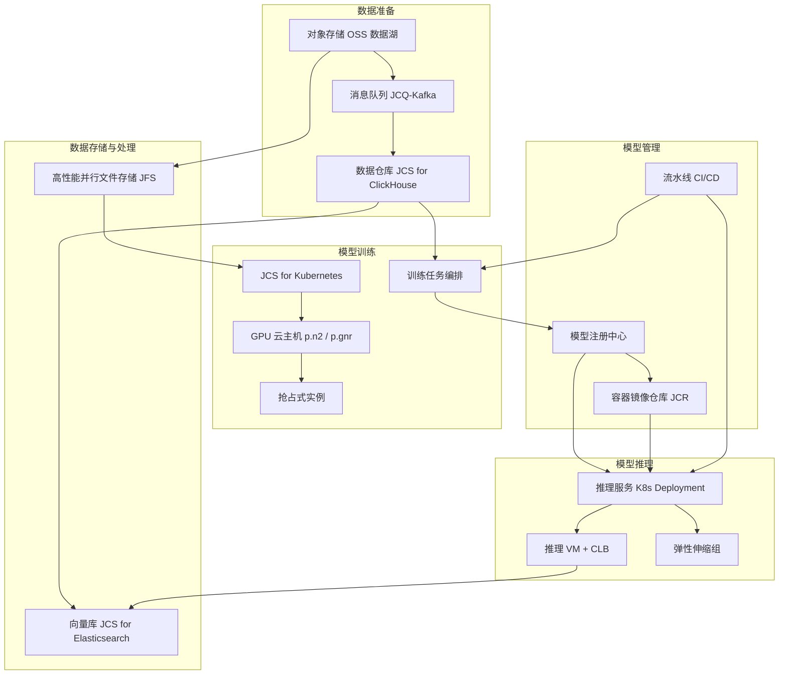

# AI/ML平台架构方案（京东云版）

##场景描述

AI/ML训练与推理平台，涵盖：
- **离线训练**: 大规模数据预处理、模型训练、超参搜索、分布式训练
- **在线推理**: 低延迟模型服务、A/B测试、弹性伸缩
- **MLOps**: 模型版本管理、特征工程、流水线编排、监控告警

典型业务:
- 大模型预训练 (LLM/VLM)
- 推荐系统 /搜索排序
- 计算机视觉 / OCR / 内容审核
-金融风控建模 / 反欺诈
-智能客服 / NLP 应用

##架构总览



##分层产品选型

###数据层（数据湖 + 向量库）

- **OSS 对象存储**:训练数据 /模型checkpoint /日志归档,标准/低频/归档分层存储
- **JCQ (Kafka 版)**:实时特征流、训练样本回流
- **JCS for ClickHouse**: OLAP 分析,训练样本统计
- **JCS for Elasticsearch (向量检索)**: RAG /召回 /文本检索,8.x启用 dense_vector

###训练层（GPU +分布式）

- **JCS for Kubernetes**: GPU节点池管理,支持弹性 +抢占式
- **GPU 云主机** (p.n2 / p.gnr 系列):
 - p.n2.8xlarge: V100/A100,适合中规模训练
 - p.gnr.16xlarge: H800/H100,大模型预训练
 - p.n2.4xlarge: 中端,适合推理和微调
- **JFS 高性能并行文件存储**:替代 CPFS,吞吐量10+ GB/s,适合分布式训练 IO
- **抢占式实例**:训练任务70%抢占 +30% 包年混合,节省60%-80%成本

###推理层（低延迟 +弹性）

- **JCS for Kubernetes (Deployment)**: 模型推理服务,支持 HPA 自动扩缩
- **VM + CLB**: 长稳态推理,适合 GPU 大模型服务(避免 K8s 网络开销)
- **弹性伸缩组**:突发流量自动扩缩,空闲自动缩容

###MLOps 与模型管理

- **JCR容器镜像仓库**:训练镜像 +推理镜像统一管理
- **模型注册中心**: 自建 (JCS for MySQL + OSS) 或对接 MLflow
- **流水线**: DataWorks 等价方案 + 自建 Argo / Airflow

###存储层

- **OSS**:训练数据 + checkpoint + 日志,生命周期规则自动归档
- **云硬盘 SSD**: 高 IO 数据盘,挂载到 GPU节点本地
- **JFS**:分布式训练共享存储

##训练规模分级

|规模 | GPU 卡数 |京东云推荐配置 | 月成本 (元) |
|------|:--------:|---------------|:----------:|
| **小规模实验** |1-4 卡 | p.n2.4xlarge ×2 + NAS + OSS |5,000 -15,000 |
| **中型训练** |8-16 卡 | p.gnr.8xlarge ×2 + JFS + OSS |30,000 -80,000 |
| **大规模预训练** |32+ 卡 | p.gnr.16xlarge ×4 + JFS + OSS |150,000 -500,000 |
| **生产推理** |4-8 卡 | VM p.n2 + CLB +弹性伸缩 |10,000 -50,000 |
| **大模型推理** |8-32 卡 | 多 GPU VM +弹性伸缩 + AS |50,000 -200,000 |

> **提示**:训练任务**强烈建议**使用抢占式实例 + 自动 checkpoint,可节省60%-80%成本。推理场景优先 K8s Deployment,空闲自动缩容。

## WAF 五支柱要求

### Security（安全）

| ID | 要求 |京东云实现 |
|----|------|-----------|
| WAF-SEC-001 |训练数据加密 | OSS服务端加密 (SSE-KMS) + KMS密钥托管 |
| WAF-SEC-002 |推理服务鉴权 | CLB + IAM Token,API Gateway限流 |
| WAF-SEC-003 |模型知识产权保护 | OSS私有 bucket + RAM Policy,只授权训练账号 |
| WAF-SEC-004 |敏感数据脱敏 |训练前 PII识别 +替换,符合《个人信息保护法》 |
| WAF-SEC-005 |训练环境隔离 |独立 VPC + 安全组,K8s namespace隔离不同业务线 |

### Reliability（可靠性）

| ID | 要求 |京东云实现 |
|----|------|-----------|
| WAF-REL-001 |checkpoint 自动保存 |训练中断后从最近 checkpoint恢复 (OSS + OSS-HDFS) |
| WAF-REL-002 |多 AZ训练 | K8s节点池跨3 AZ,Pod 反亲和调度 |
| WAF-REL-003 |推理服务冗余 | K8s Deployment ≥2副本 + CLB 健康检查 |
| WAF-REL-004 |数据备份 | OSS跨区域复制 (CRR)训练数据异地备份 |
| WAF-REL-005 |抢占回收保护 |抢占式实例 +5min告警 → 自动 checkpoint +迁移 |

### Performance（性能）

| ID | 要求 |京东云实现 |
|----|------|-----------|
| WAF-PERF-001 |高吞吐存储 | JFS替代本地 NVMe,分布式训练 IO10+ GB/s |
| WAF-PERF-002 |GPU 网络低延迟 | RDMA高速互联 (p.gnr 系列支持) |
| WAF-PERF-003 |推理低延迟 | 模型量化 (INT8/FP16) + TensorRT优化,延迟降低2-4倍 |
| WAF-PERF-004 |GPU 利用率 | 利用 K8s GPU Share / MIG切片,单卡多任务 |
| WAF-PERF-005 |向量检索性能 | JCS for Elasticsearch HNSW索引,百万级毫秒响应 |

### Cost（成本）

| ID | 要求 |京东云实现 |
|----|------|-----------|
| WAF-COST-001 |抢占式实例优先 |训练任务70%抢占 +30% 包年,成本节省60% |
| WAF-COST-002 |自动停机 |训练结束自动释放 GPU节点,空闲节点池缩容到0 |
| WAF-COST-003 |存储分层 | OSS 标准(30 天) → IA(180 天) →归档,降低存储成本 |
| WAF-COST-004 |推理弹性 | ASK 等价方案 + K8s HPA,空闲副本数 =0 |
| WAF-COST-005 |模型量化 | INT8/FP16推理,GPU 用量减半 |
| WAF-COST-006 |特征复用 |离线特征入 ClickHouse,在线复用,避免重复计算 |

### Efficiency（效率）

| ID | 要求 |京东云实现 |
|----|------|-----------|
| WAF-EFF-001 |CI/CD流水线 | Argo / Airflow编排,训练镜像自动构建 |
| WAF-EFF-002 |实验追踪 | MLflow / 自建,记录超参/指标/checkpoint |
| WAF-EFF-003 |GPU调度 | K8s + Volcano,binpack策略,任务调度到最少节点 |
| WAF-EFF-004 |模型 A/B 测试 |推理层蓝绿发布 + CLB权重分流 |
| WAF-EFF-005 |资源标签 | 所有 GPU节点打标签 (project/env/team),便于成本归集 |

##训练与推理分离架构（推荐）

```mermaid
graph LR
 subgraph训练集群(独立 VPC)
 T1[训练任务1]
 T2[训练任务2]
 T3[训练任务3]
 T_JFS[JFS共享存储]
 T_OSS[OSS checkpoint]
 end
 subgraph推理集群(独立 VPC)
 I1[推理服务1]
 I2[推理服务2]
 I_CLB[CLB]
 I_REG[模型注册中心]
 end

 T1 --> T_JFS
 T2 --> T_JFS
 T3 --> T_JFS
 T1 --> T_OSS --> I_REG
 T2 --> T_OSS
 T3 --> T_OSS
 I_REG --> I1 --> I_CLB
 I_REG --> I2 --> I_CLB
```

> **优势**:
> -训练突发资源不污染推理
> -推理稳定 +训练弹性,各自独立扩缩
> -跨 VPC通信通过 OSS / 模型注册中心

##大模型推理参考（LLM Serving）

|场景 | 推荐方案 |
|------|---------|
|7B 模型(单卡) | p.n2.4xlarge + vLLM + TensorRT-LLM |
|13B-30B 模型(多卡) | p.gnr.8xlarge ×2 +推理框架 + CLB |
|70B+ 模型(多节点) | p.gnr.16xlarge ×4-8 + DeepSpeed +高速 RDMA |
| 高并发推理 | K8s + 多副本 +弹性伸缩 +量化 (INT8) |
| RAG检索增强 | JCS for Elasticsearch 向量库 + LLM推理 |

##成本估算（月）

|场景 | 月成本(元) | GPU规模 | 说明 |
|------|:----------:|:--------:|------|
| 小规模实验 |5,000 -15,000 |1-4 卡 |抢占式训练 + OSS + NAS |
| 中型训练平台 |30,000 -80,000 |8-16 卡 |混合实例 + JFS + OSS |
| 大规模预训练 |150,000 -500,000 |32+ 卡 | A100/H800 + JFS |
| 生产推理 |10,000 -50,000 |4-8 卡 | K8s弹性 +量化 |
| 大模型在线推理 |50,000 -200,000 |8-32 卡 | 多 GPU +弹性伸缩 |

##关键陷阱（避免踩坑）

1. **Python3.12 vs3.10**: jdcloud_cli==1.2.12 不兼容 Python3.12,必须3.10
2. **CLI凭证写 INI**: `jdc` 不读 env vars,必须写 `~/.jdc/config`
3. **jdc 输出 JSON路径**: `$.result.<resources>` 小写,不是 `$.Resources.Resource[]`
4. **VPC 内 GPU节点通信**: K8s CNI 选择,避免 VXLAN性能损耗
5. **OSS跨 region复制**: CRR异步,延迟分钟级,不适合实时同步
6. **抢占式实例**:训练任务必须配合 checkpoint + 自动恢复,否则浪费进度

## 推荐实施路线图

|阶段 | 时长 | 内容 |
|------|------|------|
| Phase1 |1-2 周 | 环境搭建:VPC + OSS + KMS + IAM + JCS K8s基础 |
| Phase2 |2-4 周 |训练流水线:Mlflow + JFS + Argo + GPU节点池 |
| Phase3 |2-3 周 |推理服务:K8s Deployment + CLB +弹性伸缩 +灰度 |
| Phase4 |持续 | MLOps完善:模型注册 + A/B +监控告警 +成本优化 |

## Changelog

| 版本 | 日期 |变更 |
|:----|:----|------|
|1.0.0 |2026-06-08 |初始版本:对齐 `alicloud-arch-advisor` 的 ai-ml.md模板,京东云产品名替换,GPU 系列 + JFS +抢占式实例方案 |
