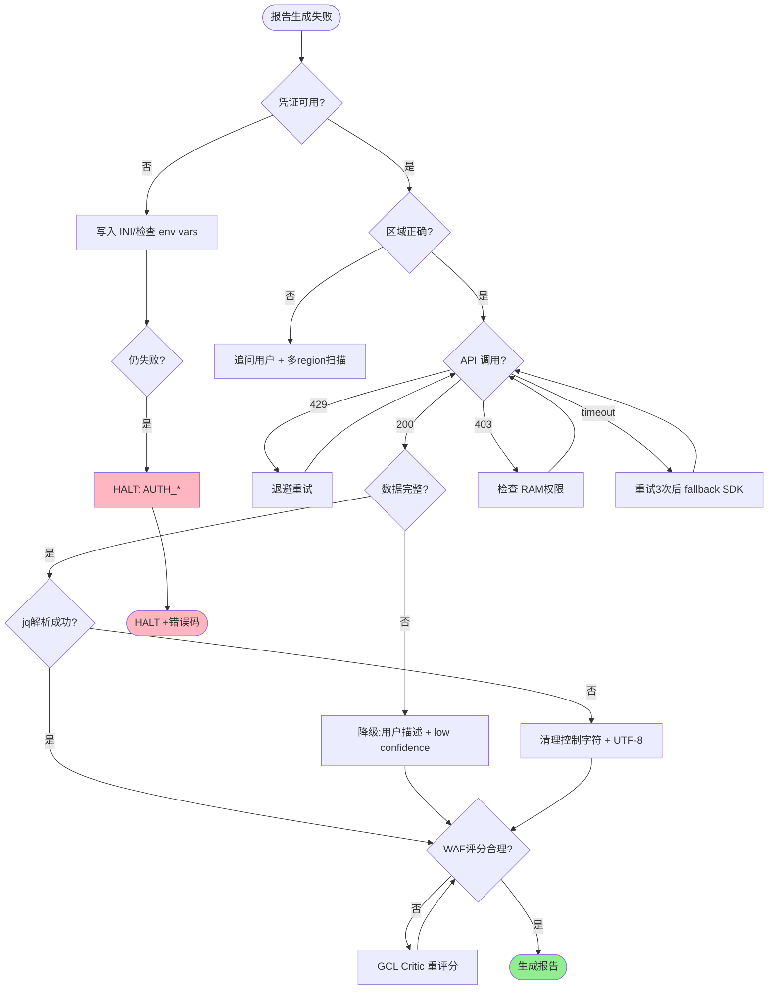

# Troubleshooting —架构评审故障排查（京东云版）

>覆盖8 大类、20+常见错误场景，按错误类型分类。每条错误含: **现象 /原因 /解决 / Agent Action**。结尾含完整诊断流程图。

---

##1.快速诊断流程图

```
报告生成失败 /质量异常
 │
 ├──1.凭证错误?
 │ ├── JDC_ACCESS_KEY缺失 → HALT,提示用户配置
 │ ├── ~/.jdc/config INI缺失 →写入 INI
 │ └── AK 无对应产品权限 → HALT,提示补 RAM策略
 │
 ├──2.区域错误?
 │ ├── jdc区域 ≠资源区域 →切换 --region-id
 │ └──资源跨多区域 → 并行调用多个区域
 │
 ├──3. API限流(429)?
 │ ├──按 Retry-After退避
 │ └──持续429 →提交工单提配额
 │
 ├──4. 数据缺失?
 │ ├──某资源类型无数据 →标注 + low confidence
 │ └──全部无数据 →降级为用户描述
 │
 ├──5. 推荐执行不可行?
 │ ├──jdc缺失子命令 →改用 Python SDK
 │ └──产品功能不可用 →改方案
 │
 ├──6. jdc CLI不可用?
 │ ├──版本不匹配 → jdcloud_cli==1.2.12
 │ └──Python3.12 vs3.10 → 重装3.10
 │
 ├──7. 安全组规则失败?
 │ ├──参数格式错误 → 检查 --rules JSON
 │ └──AddressPrefix冲突 →改 CIDR
 │
 └──8. JSON解析失败?
 ├──中文字符 → 确保 LANG=en_US.UTF-8
 └──编码异常 →显式 --output json 后 jq
```

---

##2.凭证错误

###2.1 `JDC_ACCESS_KEY` / `JDC_SECRET_KEY` 环境变量未设置

**现象**:
```bash
$ jdc --output json vm describe-instances --region-id cn-north-1
[ERROR] MissingCredentialError: JDC_ACCESS_KEY and JDC_SECRET_KEY environment variables are required
```

**原因**:
- Agent runtime 未注入 env vars
- `.env` 文件未加载
- Shell session缺少 export

**解决**:
```bash
#1.确认 env vars
test -n "$JDC_ACCESS_KEY" && echo "AK OK" || echo "AK MISSING"
test -n "$JDC_SECRET_KEY" && echo "SK OK" || echo "SK MISSING"

#2. 从 .env加载 (幂等)
if [ -f .env ]; then
 set -a; source .env; set +a
fi

#3.重新 export (如果必要)
export JDC_ACCESS_KEY="..."
export JDC_SECRET_KEY="..."
```

**Agent Action**:
1. **NEVER ask user** 输入凭证（违反 `{{env.*}}`约定）
2. HALT报告生成，提示: "凭证缺失，请在 Agent runtime 或 `.env` 中配置 `JDC_ACCESS_KEY` / `JDC_SECRET_KEY`"
3.标注错误码: `AUTH_MISSING_CREDENTIALS`

###2.2 `~/.jdc/config` INI 文件缺失或格式错误

**现象**:
```bash
$ jdc --output json vm describe-instances --region-id cn-north-1
[ERROR] ConfigError: Cannot read config file /root/.jdc/config
#或
[ERROR] ConfigParserError: section 'default' not found
```

**原因**:
- **CRITICAL**: `jdc` CLI **不读取**环境变量，**只读取** `~/.jdc/config` INI
- INI 文件未生成或路径不对
- INI缺少 `[default]` section
- `~/.jdc/current`末尾多换行符（导致 profile解析失败）

**解决**:
```bash
#1.确认 INI存在
ls -la ~/.jdc/config

#2.重新写入（必须包含 [default]）
mkdir -p ~/.jdc
cat > ~/.jdc/config << 'CONFIGEOF'
[default]
access_key = {{env.JDC_ACCESS_KEY}}
secret_key = {{env.JDC_SECRET_KEY}}
region_id = cn-north-1
endpoint = vm.jdcloud-api.com
scheme = https
timeout =20
CONFIGEOF

#3.修正 current 文件（无换行）
printf "%s" "default" > ~/.jdc/current # 注意：不能用 echo（会带换行）
```

**Agent Action**:
1. 检测到 CLI凭证错误时**自动**写入 `~/.jdc/config`
2. 注意：写入 AK 后**禁止回显**到日志
3.标注错误码: `AUTH_CLI_CONFIG_MISSING`

###2.3凭证无对应产品权限

**现象**:
```bash
$ jdc --output json rds describe-database-instances --region-id cn-north-1
[ERROR] 403 Forbidden: User not authorized to perform action 'rds:Describe*'
```

**原因**:
- AK关联的 RAM 用户/角色未授权目标产品
-跨账号 STS角色未授予 `rds:Describe*`

**解决**:
```json
//推荐策略: ArchAdvisorReadOnly
{
 "Version": "1",
 "Statement": [
 {
 "Effect": "Allow",
 "Action": [
 "vm:Describe*", "disk:Describe*",
 "rds:Describe*",
 "cache:Describe*",
 "es:Describe*",
 "lb:Describe*",
 "vpc:Describe*",
 "eip:Describe*",
 "iam:List*",
 "kms:List*",
 "monitor:Get*",
 "tag:List*",
 "actiontrail:Describe*"
 ],
 "Resource": "*"
 }
 ]
}
```

**Agent Action**:
1.区分错误类型: **凭证缺失** vs **凭证无权限**
2. **HALT**（不重试，重试不会改变权限）
3. 输出明确指引: "请为主账号或子账号授予 ArchAdvisorReadOnly策略"
4.标注错误码: `AUTH_INSUFFICIENT_PERMISSION`

---

##3.区域错误

###3.1 `cn-north-1`资源无法 describe

**现象**:
```bash
$ jdc --output json vm describe-instances --region-id cn-north-1
{
 "error": { "code": "ResourceNotFound", "message": "No instances found" }
}
```
但用户反馈资源在 `cn-north-1`。

**原因**:
- 用户实际资源在 `cn-east-1` / `cn-south-1` / `cn-west-1`
- Agent 默认 `JDC_REGION` 与资源所在 region 不符

**解决**:
```bash
#1.询问用户实际地域
echo "请确认您的资源所在地域？ (cn-north-1/cn-east-1/cn-south-1/cn-west-1)"

#2.切换 --region-id
jdc --output json vm describe-instances --region-id cn-east-1 --page-size1

#3. 多地域并行扫描（架构评审场景）
for region in cn-north-1 cn-east-1 cn-south-1; do
 jdc --output json vm describe-instances --region-id "$region" --page-size1
done
```

**Agent Action**:
1. 检测到资源为空时**追问用户**实际地域
2.升级到多 region 并行扫描
3.标注错误码: `REGION_MISMATCH`

###3.2资源跨多区域

**现象**:
架构评审发现资源分散在多个 region，单次调用只能扫描一个区域。

**原因**:
- 大型企业多 region部署
- 用户不知道资源分散

**解决**:
```bash
#多 region 并行扫描（每个 region独立 result）
arch-advisor-data-collect:
 regions: [cn-north-1, cn-east-1, cn-south-1]
 parallel: true
 timeout:30s
```

**Agent Action**:
1. 自动启用多 region 并行扫描
2.报告中标注每个 region 的资源清单
3.标注错误码: `REGION_MULTI`

---

##4.API限流（429）

###4.1 HTTP429 Throttling错误

**现象**:
```bash
$ jdc --output json vm describe-instances --region-id cn-north-1 --page-size100
[ERROR] 429 Throttling: Request was throttled. Expected available in1500ms
```

**原因**:
-短时间内调用过多，超过京东云 API QPS限制
-多个下游 Skill 并行调用叠加触发限流

**解决**:
```bash
#1.指数退避重试
attempt=0
max_attempts=3
backoff=(024) # 秒
while [ $attempt -lt $max_attempts ]; do
 response=$(jdc --output json vm describe-instances --region-id cn-north-1 --page-size1002>/dev/null)
 if [ $? -eq0 ]; then
 echo "$response" | jq .
 break
 fi
 if echo "$response" | grep -q "429"; then
 sleep ${backoff[$attempt]}
 attempt=$((attempt+1))
 else
 echo "NON-429 error, abort retry"
 break
 fi
done
```

**Agent Action**:
1. 检测到429 →按 Retry-After退避（1s →2s →4s）
2.最多重试3次,失败后**降级**为: 基于已有数据的部分报告
3.报告 `limitations` 中标注: "因 API限流，部分资源清单未能完整采集"
4.标注错误码: `RATE_LIMITED`

###4.2持续429触发硬限流

**现象**:
持续调用同一 API5分钟以上仍返回429，即使等待Retry-After。

**原因**:
- 主账号配额硬性限制
-共享 AK 被其他业务消耗

**解决**:
1.提交京东云工单申请提配额
2.切换到其他 AK（独立配额）
3.降低扫描频率（增加 sleep）

**Agent Action**:
1. HALT持续重试
2.提示用户: "持续限流，建议:①申请配额②等待1小时重试③切换 AK"
3.标注错误码: `RATE_LIMIT_HARD`

---

##5.数据缺失

###5.1某资源类型无数据

**现象**:
```bash
$ jdc --output json cache describe-cache-instances --region-id cn-north-1
{ "result": { "cacheInstances": [] } }
```

**原因**:
- 用户确实没有 Redis 实例
- Redis 在其他 region
- Redis 在其他账号（跨账号资源不可见）

**解决**:
1. **确认用户场景**:询问用户是否实际部署了 Redis
2. **跨 region扫描**:尝试 `cn-east-1` / `cn-south-1`
3. **跨账号**: 通过 STS AssumeRole切换到目标账号

**Agent Action**:
1.资源列表为空 → 不视为错误
2. 在报告中标注: "Redis 数据为空，用户未部署 Redis 或在扫描范围之外"
3.评估时按"该资源类型不适用"处理，**不扣分**
4.标注错误码: `DATA_EMPTY_NON_ERROR`

###5.2全部资源无数据（凭证错配导致）

**现象**:
所有13+ Skill 调用均返回空或403。

**原因**:
- AK 配置错误（写到错误的 profile）
- INI 文件的 `[default]` section指向错误 AK

**解决**:
```bash
#1. 检查 INI 当前 AK
jdc config get default.access_key # 仅显示前4位
jdc config get default.secret_key | head -c4 && echo "..."

#2.验证 AK有效性（用最简单的 vm list）
jdc --output json vm describe-instances --region-id cn-north-1 --page-size1
# 如果返回403 →凭证错配
# 如果返回200 + 空 →凭证正确，无资源
```

**Agent Action**:
1. **HALT**报告生成
2.明确提示: "凭证可能错配，请检查 `~/.jdc/config` 与 `JDC_ACCESS_KEY` 是否一致"
3.标注错误码: `DATA_ALL_EMPTY_CREDENTIAL_MISMATCH`

---

##6.推荐执行不可行

###6.1 jdc缺失子命令

**现象**:
需要执行某个操作（如 "查看 NAT Gateway 高可用配置"），但 `jdc` CLI **没有对应子命令**。

**原因**:
-京东云 CLI1.2.12 不覆盖全部 API（如 NAT Gateway、OSS 等）
- 部分高级操作仅 SDK 支持

**解决**:
```bash
#1.确认 jdc 子命令列表
jdc vpc --help # 查看 VPC 类所有子命令
jdc --help # 查看全局命令

#2. CLI 不支持 →改用 Python SDK fallback
python3 << 'PYEOF'
from jdcloud_sdk.core.credential import Credential
from jdcloud_sdk.services.vpc.client import VpcClient
import os

cred = Credential(os.environ['JDC_ACCESS_KEY'], os.environ['JDC_SECRET_KEY'])
client = VpcClient(cred, 'cn-north-1')

#示例:describe NatGateway
from jdcloud_sdk.services.vpc.apis.DescribeNatGatewaysRequest import DescribeNatGatewaysRequest
req = DescribeNatGatewaysRequest({'regionId': 'cn-north-1'})
resp = client.describeNatGateways(req)
print(resp)
PYEOF
```

**Agent Action**:
1. jdc失败 → 自动 fallback 到 Python SDK（3 次重试后再 fallback）
2. SDK也不支持 →标注 `manual_check: true`，建议用户登录控制台或调用 OpenAPI
3.标注错误码: `CLI_NOT_SUPPORTED`

###6.2 推荐方案技术冲突

**现象**:
架构评审推荐方案包含产品组合，但实际京东云不支持（如"GPU VM + JCS for Kubernetes + 自建GPU Operator"在该 region不可用）。

**原因**:
- 推荐的产品在目标 region缺货
- 推荐的产品组合未经过京东云兼容性测试
- 推荐规格超过配额

**解决**:
1. 检查产品可用性: `jdc <product> describe-instance-types`
2. 检查配额: `jdc <product> describe-quota`
3.改用 region内的替代产品

**Agent Action**:
1. **GCL Critic** 应在 Safety/Correctness维度扣分
2.重新设计方案，提供至少2 个可行方案对比
3.标注错误码: `RECOMMENDATION_INFEASIBLE`

---

##7.jdc CLI不可用

###7.1 `jdcloud_cli` 版本不匹配

**现象**:
```bash
$ pip install jdcloud_cli
$ jdc --version
jdcloud_cli1.2.10 # 不是1.2.12
#或:ImportError: cannot import name 'SafeConfigParser'
```

**原因**:
-京东云 CLI 版本 <1.2.12
- Python3.12+移除了 `SafeConfigParser`（jdcloud_cli1.x依赖）
- 默认 pip索引慢或不可达

**解决**:
```bash
#1. Python 版本必须3.10（不是3.12）
uv venv --python3.10 # 必须3.10
source .venv/bin/activate
python --version # Python3.10.x

#2.锁版本安装
uv pip install jdcloud_cli==1.2.12 jdcloud_sdk>=1.6.26

#3.验证
jdc --version # 应为1.2.12
python -c "import jdcloud_sdk; print('SDK OK')"

#4. pip索引（国内加速）
uv pip install --index-url https://mirrors.aliyun.com/pypi/simple/ jdcloud_cli==1.2.12
```

**Agent Action**:
1. 检测到 Python3.12+ → **HALT** 并提示: "请使用 Python3.10（jdcloud_cli1.x 不兼容3.12）"
2. 检测到 jdcloud_cli 版本 ≠1.2.12 → 重装锁定版本
3.标注错误码: `CLI_VERSION_MISMATCH`

###7.2 Python3.10 vs3.12陷阱

**现象**:
```python
# Python3.12+
>>> from configparser import SafeConfigParser
ImportError: cannot import name 'SafeConfigParser'. Did you mean: 'RawConfigParser'?
```

**原因**:
- `SafeConfigParser` 在 Python3.12已被重命名为 `ConfigParser`
- `jdcloud_cli==1.2.12`仍引用旧名称

**解决**:
```bash
# macOS
brew install python@3.10
uv python install3.10
uv venv --python3.10 # 必须指定

# Linux
apt install python3.10 python3.10-dev
uv python install3.10

# Windows
# 下载 https://www.python.org/downloads/release/python-3100/
```

**Agent Action**:
1. **CRITICAL**:任何 jdcloud Skill启动前必须先检测 Python 版本
2. Python ≥3.11 →警告但不阻止（兼容性未知）
3. Python ≥3.12 → **HALT** 并提示重装3.10
4.标注错误码: `PYTHON_VERSION_INCOMPATIBLE`

###7.3 `jdc` 命令 not found

**现象**:
```bash
$ jdc --version
bash: jdc: command not found
```

**原因**:
- `jdcloud_cli` 未安装
- venv 未激活
- PATH 未配置

**解决**:
```bash
#1.激活 venv
source .venv/bin/activate

#2.重新安装
uv pip install jdcloud_cli==1.2.12

#3.验证
which jdc # 应输出: .venv/bin/jdc
jdc --version
```

**Agent Action**:
1. 自动激活 venv +重装
2.标注错误码: `CLI_NOT_INSTALLED`

---

##8.安全组规则失败

###8.1 `add-security-group-rules` 参数格式错误

**现象**:
```bash
$ jdc --output json vpc add-security-group-rules \
 --region-id cn-north-1 \
 --security-group-id sg-xxxxx \
 --rules '[{"direction":"ingress","protocol":"tcp","port":"22"}]'
[ERROR] InvalidParameter: rules[0].fromPort must be integer, got string
```

**原因**:
- `port` 应拆为 `fromPort` + `toPort`（整数）
- `addressPrefix`缺失
- `protocol` 值错误（应为 `tcp`/`udp`/`icmp`/`-1` 表示 all）

**解决**:
```bash
#1.修正参数
jdc --output json vpc add-security-group-rules \
 --region-id cn-north-1 \
 --security-group-id sg-xxxxx \
 --rules '[{
 "direction": "ingress",
 "protocol": "tcp",
 "fromPort":22,
 "toPort":22,
 "addressPrefix": "10.0.0.0/8",
 "description": "Allow SSH from internal network"
 }]'

#2.验证规则已添加
jdc --output json vpc describe-security-group --region-id cn-north-1 --security-group-id sg-xxxxx \
 | jq '.result.securityGroup.rules[] | select(.fromPort ==22)'
```

**Agent Action**:
1. 检测到参数错误 → 输出**正确格式示例**
2. 不重试（重试同样错误）
3.标注错误码: `SG_RULE_FORMAT_ERROR`

###8.2 `addressPrefix` 与已有规则冲突

**现象**:
```bash
[ERROR] SecurityGroupRuleConflict: rule overlaps with existing rule (0.0.0.0/0:80)
```

**原因**:
- 已存在更宽泛的规则（如 `0.0.0.0/0:80`），新增 `10.0.0.0/8:80` 被覆盖
- 反向: 已存在更窄规则，新增宽泛规则被拒绝

**解决**:
1. 先 describe现有规则，再决定 add 还是 modify
2.必要时先 `remove-security-group-rules` 再 add

**Agent Action**:
1. 调用前**先 describe**现有规则，避免冲突
2.标注错误码: `SG_RULE_CONFLICT`

---

##9.JSON解析失败

###9.1 jdc 输出中文编码异常

**现象**:
```bash
$ jdc --output json vm describe-instances --region-id cn-north-1 | jq '.result.instances[0].name'
"vm-\u4e2d\u6587\u540d\u79f0-001" # 中文 Unicode 转义
```

或

```bash
jq: parse error: Invalid string: control character U+001F at line5
```

**原因**:
- locale 未设置 UTF-8
- jdc 输出含控制字符（如 `\u001F`）
- 中文 Windows终端 GBK编码

**解决**:
```bash
#1. 设置 locale
export LANG=en_US.UTF-8
export LC_ALL=en_US.UTF-8

#2.强制 UTF-8解析
jdc --output json vm describe-instances --region-id cn-north-1 \
 | jq -r '.result.instances[].name'

#3. 如仍失败,清理控制字符
jdc --output json vm describe-instances --region-id cn-north-1 \
 | tr -d '\001-\010\013-\037' \
 | jq '.result.instances | length'
```

**Agent Action**:
1. 输出前先 `export LANG=en_US.UTF-8`
2.解析失败时用 `tr -d '\001-\010\013-\037'`清理
3.标注错误码: `JSON_PARSE_ERROR`

###9.2 `result`字段为空

**现象**:
```bash
$ jdc --output json vm describe-instances --region-id cn-north-1 | jq '.result'
null
```

**原因**:
-资源在该 region真的不存在
-凭证无权限（实际返回 error 但 jq路径错了）
- jdc 版本 bug（早期版本 `result`字段名不一致）

**解决**:
```bash
#1. 检查完整响应
jdc --output json vm describe-instances --region-id cn-north-1 | jq '.'
# 查看是否有 .error字段

#2.升级 jdcloud_cli
uv pip install --upgrade jdcloud_cli==1.2.12

#3.验证返回路径
#正确: $.result.instances[]
#错误: $.result.Instances[] (阿里云风格)
#错误: $.Instances.Instance[] (更老)
```

**Agent Action**:
1. 检查完整响应而非仅 `result`
2.升级 CLI 到1.2.12
3.标注错误码: `JSON_RESULT_NULL`

###9.3数字精度丢失（ID截断）

**现象**:
```bash
$ jdc --output json vm describe-instances --region-id cn-north-1 | jq '.result.instances[0].instanceId'
"i-abc123" # 应为 "i-abc123def456"完整 ID
```

**原因**:
- jq 默认输出截断长字符串
- 部分 jdc终端工具截断显示

**解决**:
```bash
#1.完整输出（jq 默认不截断,检查 jq 版本)
jq --version # >=1.5 应正常
jdc --output json vm describe-instances --region-id cn-north-1 \
 | jq -r '.result.instances[0].instanceId'

#2. 如 jq 版本过低
brew install jq # macOS
apt install jq # Linux
```

**Agent Action**:
1.始终使用 `-r`(raw)避免引号干扰
2.升级 jq 到 ≥1.5
3.标注错误码: `JSON_ID_TRUNCATED`

---

##10.错误码汇总

|错误码 | 类型 | 说明 | Agent Action |
|--------|------|------|-------------|
| `AUTH_MISSING_CREDENTIALS` |凭证 | env vars 未设置 | HALT,提示 runtime 配置 |
| `AUTH_CLI_CONFIG_MISSING` |凭证 | INI缺失 | 自动写入 INI |
| `AUTH_INSUFFICIENT_PERMISSION` |凭证 |权限不足 | HALT,提示 RAM策略 |
| `REGION_MISMATCH` |区域 | region 不符 |追问用户 + 多 region扫描 |
| `REGION_MULTI` |区域 |跨多 region | 自动多 region 并行 |
| `RATE_LIMITED` |限流 | HTTP429 |退避重试3次 |
| `RATE_LIMIT_HARD` |限流 |持续429 | HALT,提示提配额 |
| `DATA_EMPTY_NON_ERROR` | 数据 |资源列表为空 | 不视为错误,不扣分 |
| `DATA_ALL_EMPTY_CREDENTIAL_MISMATCH` | 数据 | 全空 +凭证错配 | HALT,凭证核查 |
| `CLI_NOT_SUPPORTED` | CLI |缺失子命令 | fallback SDK |
| `RECOMMENDATION_INFEASIBLE` |方案 | 推荐不可行 |重新设计 +至少2方案 |
| `CLI_VERSION_MISMATCH` | 环境 | 版本 ≠1.2.12 | 重装锁定版本 |
| `PYTHON_VERSION_INCOMPATIBLE` | 环境 | Python ≥3.12 | HALT,提示装3.10 |
| `CLI_NOT_INSTALLED` | 环境 | jdc 命令未找到 |激活 venv + 重装 |
| `SG_RULE_FORMAT_ERROR` | 安全组 | 参数格式错 | 输出正确示例,不重试 |
| `SG_RULE_CONFLICT` | 安全组 |规则冲突 | 先 describe 后操作 |
| `JSON_PARSE_ERROR` |解析 |编码异常 | 设置 UTF-8 +清理控制字符 |
| `JSON_RESULT_NULL` |解析 | result 为空 | 检查 error +升级 CLI |
| `JSON_ID_TRUNCATED` |解析 | ID截断 |升级 jq + raw 输出 |

---

##11. GCL 相关故障

|错误 |原因 | Agent Action |
|------|------|-------------|
| **Safety =0** | Generator 输出写操作建议 | **ABORT**立即;只能输出只读建议 |
| **Correctness <0.7** |架构分析结论错误 | **HALT**,重新采集数据或追问用户 |
| **Traceability <0.8** |报告缺少数据源标注 |修正报告,添加 data_sources |
| **Spec Compliance <0.8** | 未遵循 WAF 标准 | 重写评分规则 + 检查 WAF规则库 |
| **max_iter =5耗尽** |5轮迭代未通过 GCL | 输出最后结果 + 未通过维度列表 |
| **数据源降级导致评分低** |关键数据源不可用 |接受降级输出,标注局限性 |

---

##12.诊断流程图



---

##13. 自查清单（生成报告前必跑）

```bash
#1. 环境健康
[ "$(python --version | cut -d' ' -f2 | cut -d'.' -f1,2)" = "3.10"] && echo "✅ Python3.10" || echo "❌ Python not3.10"
jdc --version | grep -q "1.2.12" && echo "✅ jdc1.2.12" || echo "❌ jdc version mismatch"

#2.凭证健康
test -n "$JDC_ACCESS_KEY" && echo "✅ JDC_ACCESS_KEY" || echo "❌ JDC_ACCESS_KEY missing"
test -n "$JDC_SECRET_KEY" && echo "✅ JDC_SECRET_KEY" || echo "❌ JDC_SECRET_KEY missing"
test -f ~/.jdc/config && echo "✅ ~/.jdc/config" || echo "❌ ~/.jdc/config missing"

#3.联通性测试
jdc --output json vm describe-instances --region-id cn-north-1 --page-size1 \
 | jq -e '.result.instances != null' \
 && echo "✅ VM API连通" || echo "❌ VM API失败"

#4.依赖 Skill 可用
for skill in vm-ops mysql-ops redis-ops clb-ops eip-ops vpc-ops iam-ops kms-ops audit-ops cloudmonitor-ops tag-audit-ops topo-discovery; do
 test -d "../jdcloud-$skill" && echo "✅ jdcloud-$skill" || echo "⚠️ jdcloud-$skill MISSING (manual_check)"
done
```

---

##14. Changelog

| 版本 | 日期 |变更 |
|:----|:----|------|
|1.0.0 |2026-06-08 |初始版本:8 大类20+故障场景,错误码体系, mermaid诊断流程图,京东云 Python3.10陷阱专项 |
