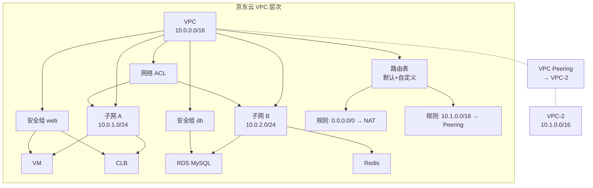

# VPC Core Concepts — jdcloud-vpc-ops

> **版本**: 1.0.0 | 最后更新: 2026-06-08

## 一、京东云 VPC 体系

VPC (Virtual Private Cloud) 是京东云网络的基础。所有京东云资源（VM、CLB、RDS、Redis 等）都在 VPC 内部部署。京东云的术语与阿里云有显著差异:

| 概念 | 京东云 | 阿里云 | 说明 |
|------|-------|-------|------|
| 虚拟专有网络 | **VPC** (同) | VPC | 同 |
| 子网/交换机 | **子网 (Subnet)** | 交换机 (VSwitch) | ⚠️ 术语不同 |
| 可用区 | **可用区 (AZ)** | 可用区 (Zone) | 同 |
| 安全组 | **安全组 (Security Group)** | 安全组 (Security Group) | 同 |
| 网络访问控制列表 | **网络 ACL** | NACL | 同 |
| 路由表 | **路由表 (Route Table)** | 路由表 (Route Table) | 同 |
| 弹性公网IP | **弹性公网IP (EIP)** | 弹性公网IP (EIP) | 同 |

## 二、核心资源详解

### 2.1 VPC (私有网络)

- **CIDR**: 10.0.0.0/8, 172.16.0.0/12, 192.168.0.0/16 及子集
- **最小 CIDR**: /28 (16 IPs), **最大**: /16 (65536 IPs)
- **默认**: 每个账号每地域默认配额 2 个 VPC
- **属性**: `vpcId`, `vpcName`, `addressPrefix`, `description`, `azType`, `createdTime`

### 2.2 Subnet (子网)

- 子网必须属于一个 VPC
- 子网 CIDR 必须在 VPC CIDR 范围内
- 每个可用区至少需要一个子网
- 一个子网只在一个可用区内
- **关键特性**: 子网是**京东云**的资源关联基础（每个 VM/CLB/RDS/Redis 都绑定到子网）

### 2.3 Security Group (安全组)

- 有状态防火墙: 允许出站流量自动允许对应入站回来
- 一个实例可以加入**多个**安全组
- 安全组规则的执行顺序: **所有规则都评估**,满足其中一条即放行
- 默认: 入站拒绝,出站允许
- 协议数值映射:

| 协议 | 数值 | 说明 |
|------|:---:|------|
| All | **300** | 所有协议 |
| TCP | **6** | TCP |
| UDP | **17** | UDP |
| ICMP | **1** | ICMP / ping |

- 规则方向:

| 方向 | 数值 | 说明 |
|:----:|:---:|------|
| inbound | **0** | 入站 |
| outbound | **1** | 出站 |

### 2.4 Route Table (路由表)

- 每个 VPC 有一个默认路由表
- 子网关联路由表后使用该路由表的路由规则
- 路由规则条目:
  - `destinationCidrBlock` (目的 CIDR)
  - `nextHopId` (下一跳 ID: VM/ENI/NAT/Peering)
  - `nextHopType` (下一跳类型)

### 2.5 Network ACL

- 无状态防火墙（比安全组更底层）
- 规则按优先级从低到高执行（数值越小越优先）
- 支持入站和出站独立规则
- 必须与子网关联才能生效

### 2.6 VPC Peering (对等连接)

- 连接两个 VPC,实现私有网络通信
- 两端 VPC CIDR 不能重叠
- 需要双方账号接受对等连接请求
- 不自动配置路由,需要人工添加路由

## 三、资源关系图

## 四、CIDR 规划建议

| 环境 | VPC CIDR | 子网 CIDR 示例 | 说明 |
|:----:|----------|---------------|------|
| 生产 | 10.0.0.0/16 | 10.0.1.0/24(APP-A), 10.0.2.0/24(DB-A) | 多 AZ |
| 预发 | 10.1.0.0/16 | 10.1.1.0/24(APP), 10.1.2.0/24(DB) | 单一 AZ |
| 测试 | 10.2.0.0/16 | 10.2.1.0/24(ALL) | 最小化 |

## 五、配额限制

| 资源 | 默认配额/地域 | 提升方式 |
|------|:-----------:|---------|
| VPC | 2 | 工单 |
| 子网 | 50/每个VPC | 工单 |
| 安全组 | 50/每个VPC | 工单 |
| 安全组规则 | 100/每个安全组 | 工单 |
| 路由表 | 10/每个VPC | 工单 |
| 网络 ACL | 2/每个VPC | 工单 |
| VPC Peering | 10/每个VPC | 工单 |