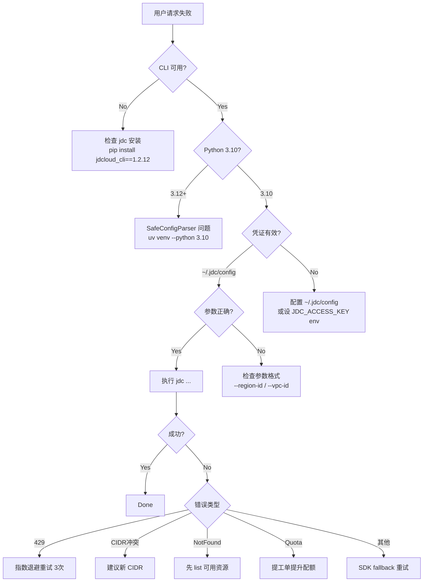

# Troubleshooting — jdcloud-vpc-ops

> **版本**: 1.0.0 — 常见错误类型表 + Agent 操作指南。

## 错误诊断流程图



## 错误模式表

### 凭证类

| 现象 | 原因 | 解决 | Agent Action |
|------|------|------|-------------|
| `Error: The AccessKeyId or AccessKeySecret is invalid` | ~/.jdc/config 中凭证错误 | 重新配置: `jdc config init` | 检查 AK/SK 格式,验证 env |
| `Error: region not found in config` | ~/.jdc/config 缺少 region_id | 补充 `region_id = cn-north-1` | 添加默认 region |
| `Error: MissingAccessKeyId` | 未配置 ~/.jdc/config | 创建 INI 文件 | 自动生成配置 |
| `ImportError: cannot import name SafeConfigParser` | Python 3.12+ | 切换 Python 3.10 | `uv venv --python 3.10` |

### 参数类

| 现象 | 原因 | 解决 |
|------|------|------|
| `InvalidParameter: vpcName must be <= 32 characters` | VPC 名称太长 | 截断到 32 字符 |
| `VpcCIDRConflict: CIDR conflicts with existing VPC` | CIDR 与已有 VPC 重叠 | 改 CIDR |
| `InvalidParameter: AddressPrefix not within VPC CIDR` | 子网 CIDR 超出 VPC 范围 | 子网 CIDR 必须在 VPC CIDR 内 |
| `InvalidParameter: protocol must be 300/6/17/1` | protocol 参数错误 | 映射: 300=All 6=TCP 17=UDP 1=ICMP |

### 资源状态类

| 现象 | 原因 | 解决 |
|------|------|------|
| `InvalidVpc.NotFound` | VPC ID 不存在 | `describe-vpcs` 列出后选 |
| `InvalidSubnet.NotFound` | 子网 ID 不存在 | `describe-subnets` 列出 |
| `InvalidSecurityGroup.NotFound` | SG ID 不存在 | `describe-network-security-groups` 列出 |
| `InvalidVpcPeering.AlreadyExists` | 对等连接已存在 | 检查已有 peering |
| `InvalidSubnet.ServiceDependence` | 子网内有资源 | 先清理 VM/CLB 后再删除子网 |
| `QuotaExceeded` | 配额超限 | 提工单提升配额 |

### 安全组规则类

| 现象 | 原因 | 解决 |
|------|------|------|
| `InvalidSecurityGroupRuleSpec` | 规则 JSON 格式错误 | 检查 JSON 语法正确 |
| `InvalidSecurityGroupRuleProtocol` | 协议号错误 | 使用 300/6/17/1 |
| `RuleLimitExceeded` | 规则数超 100 | 清理无用规则或提工单 |
| `DuplicateRule` | 重复规则 | 检查已有规则,避免重复 |

### 网络/超时类

| 现象 | 原因 | 解决 |
|------|------|------|
| 429 Too Many Requests | 请求频率过高 | 指数退避: 0s/2s/4s/8s |
| 连接超时 | 网络问题 | 检查 VPC endpoint 可连通性 |
| 502 Bad Gateway | endpoint 临时故障 | 重试 3 次 |

### 特殊: Python 3.12 陷阱

```python
# 在 Python 3.12 中运行 jdcloud_cli==1.2.12
>>> from configparser import SafeConfigParser
ImportError: cannot import name 'SafeConfigParser' from 'configparser'

# 解决方案 1: 切换到 Python 3.10
uv venv --python 3.10
source .venv/bin/activate

# 解决方案 2: 安装修复版本(如果未来 jdcloud_cli 修复了此问题)
# 目前必须用 Python 3.10
```

## 安全组规则 JSON 常见问题

### 正确的 JSON 格式

```json
[
  {
    "protocol": 6,
    "direction": 0,
    "addressPrefix": "0.0.0.0/0",
    "fromPort": 80,
    "toPort": 80,
    "description": "HTTP"
  }
]
```

### 常见错误

| 错误写法 | 正确写法 | 原因 |
|---------|---------|------|
| `protocol: "tcp"` | `protocol: 6` | 协议必须是数值 |
| `direction: "inbound"` | `direction: 0` | 方向必须是 0/1 |
| `fromPort: "80"` | `fromPort: 80` | 端口必须是整数 |
| `addressPrefix: "0.0.0.0"` | `addressPrefix: "0.0.0.0/0"` | CIDR 必须带掩码 |
| JSON 格式不合法(单引号) | 双引号 | JSON 标准 |